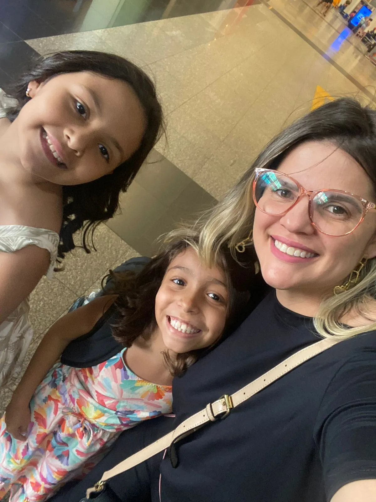
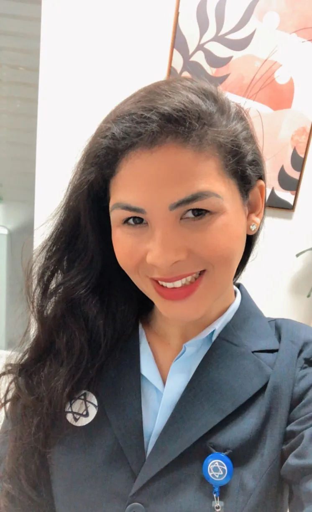

<h1 align="center">🌟 Tech Ladies - HackaDev Bootcamp 🌟</h1>

  

 

## 🌷 Membros:

---

<!-- Ana Karolina Souza -->

<!-- nome -->
 
  
 <!-- foto -->
     
    <!-- about -->
    </a>
 
<!-- github -->
    

---

<!-- Denise Carvalho -->

<!-- nome -->
 
  
 <!-- foto -->
     
    <!-- about -->
    
    
 
<!-- github -->
    

---

<!-- Gisely Meneses de Oliveira -->

<!-- nome -->
 
  
 <!-- foto -->
     
    <!-- about -->
    
    
 
<!-- github -->
    

---

<!-- Grazielly Anastacio da Cunha -->

<!-- nome -->
 
  
 <!-- foto -->
     
    <!-- about -->
    
    
 
<!-- github -->
    

---

<!-- Josielly Tomas da Fonseca Macedo -->

<!-- nome -->
 
  
 <!-- foto -->
     
    <!-- about -->
    
    
 
<!-- github -->
    

---

<!-- Paulini Duarte Marinho Gomes -->

<!-- nome -->

  
 <!-- foto -->
     
    <!-- about -->
    
    
 
<!-- github -->
    

---

<!-- Renata Rodrigues Antonio Ribeiro -->

<!-- nome -->

  
 <!-- foto -->
     
    <!-- about -->
    
    
 
<!-- github -->
    

